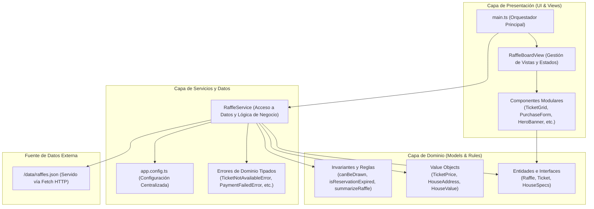
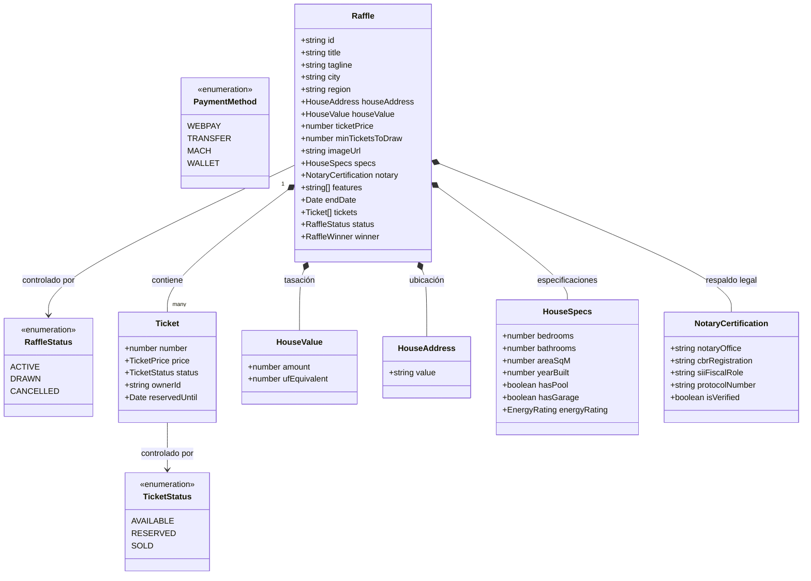
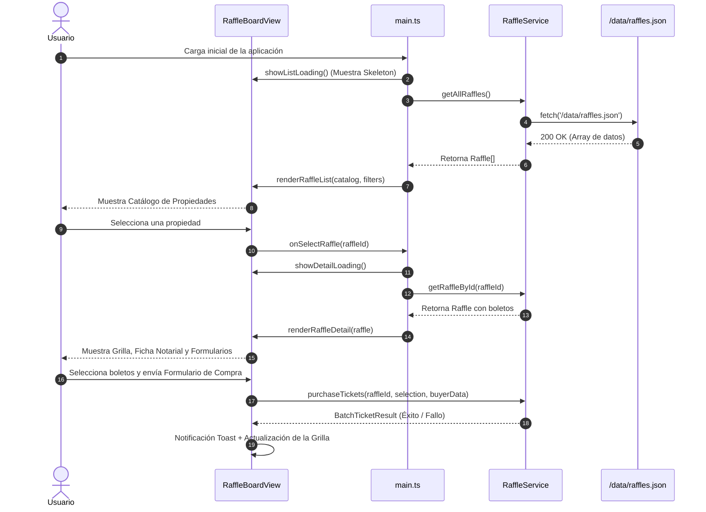
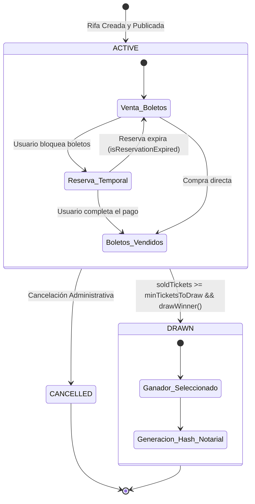

# 🏠 ClickTuCasa — Frontend Dinámico con TypeScript y Vite (Hito 2)

Plataforma web de **Rifas de Viviendas Certificadas ante Notario**, desarrollada en **TypeScript Vanilla estricto (`strict: true`)** y empaquetada con **Vite**.

El sistema implementa una arquitectura desacoplada basada en **Clean Architecture** y **Domain-Driven Design (DDD)**, replicando fielmente las entidades, invariantes notariales y casos de uso del dominio inmobiliario.

> **Estado:** en desarrollo activo para el Hito 2. El repositorio cumple los tres pilares técnicos de la rúbrica (ver [Rúbrica y cumplimiento técnico](#-rúbrica-y-cumplimiento-técnico)); la sección [Estado del proyecto y hoja de ruta](#-estado-del-proyecto-y-hoja-de-ruta) documenta con total transparencia los defectos de comportamiento, deuda técnica y pendientes de entrega detectados en la auditoría más reciente, con su plan de corrección.

---

## 📋 Tabla de Contenidos

1. [Visión General del Proyecto](#-visión-general-del-proyecto)
2. [Tecnologías y Estándares](#-tecnologías-y-estándares)
3. [Instalación y Guía de Ejecución](#-instalación-y-guía-de-ejecución)
4. [Arquitectura del Sistema](#-arquitectura-del-sistema)
   - [Diagrama de Arquitectura en Capas](#diagrama-de-arquitectura-en-capas)
   - [Estructura del Proyecto](#estructura-del-proyecto)
5. [Modelado de Dominio e Invariantes de Negocio](#-modelado-de-dominio-e-invariantes-de-negocio)
   - [Diagrama de Entidades y Relaciones](#diagrama-de-entidades-y-relaciones)
   - [Invariantes Notariales y Value Objects](#invariantes-notariales-y-value-objects)
6. [Consumo de Datos Asíncrono (`fetch`) y Arquitectura de Red](#-consumo-de-datos-asíncrono-fetch-y-arquitectura-de-red)
   - [Implementación Exacta del `fetch`](#implementación-exacta-del-fetch)
   - [Las Dos Fases del Desempaquetado Asíncrono](#las-dos-fases-del-desempaquetado-asíncrono)
   - [Flujo Completo de Llamadas](#flujo-completo-de-llamadas)
7. [Catálogo de Componentes y Vistas](#-catálogo-de-componentes-y-vistas)
   - [Diagrama de Flujo de Interacción de Usuario](#diagrama-de-flujo-de-interacción-de-usuario)
8. [Formularios y Validaciones del Mercado Chileno](#-formularios-y-validaciones-del-mercado-chileno)
9. [Ciclo de Vida de una Rifa](#-ciclo-de-vida-de-una-rifa)
10. [Rúbrica y Cumplimiento Técnico](#-rúbrica-y-cumplimiento-técnico)
11. [Estado del proyecto y hoja de ruta](#-estado-del-proyecto-y-hoja-de-ruta)
12. [Autor y Licencia](#-autor-y-licencia)

---

## 🌟 Visión General del Proyecto

**ClickTuCasa** democratiza el acceso a la vivienda propia mediante sorteos transparentes y legalmente blindados:
- Cada propiedad cuenta con una cantidad acotada de **boletos numerados** (ej. 15.000 boletos).
- Los usuarios pueden **explorar el catálogo**, filtrar por región/ciudad/estado, buscar folios exactos, **reservar temporalmente** o **comprar boletos** mediante pasarelas de pago simuladas.
- Cada rifa protege un **umbral mínimo legal de boletos vendidos** (`minTicketsToDraw`). Al cumplirse, se habilita la ejecución notarial del sorteo generando un hash criptográfico de verificación.

```ascii
+-------------------------------------------------------------------------------+
|                                CLICKTUCASA                                    |
|                                                                               |
|   [ Catálogo de Rifas ] ----> [ Selección de Boletos ] ----> [ Compra/Reserva ]|
|            |                           |                            |         |
|            v                           v                            v         |
|     Filtros Dinámicos           Grilla Paginada             Validación RUT    |
|    Métricas Inmueble           Cesta de Boletos             Módulo 11 + Tel   |
|    Garantía Notarial           Cálculo de Probabilidad      Pasarela de Pago  |
|                                                                               |
|                   [ Sorteo Notarial con Hash de Acta ]                        |
+-------------------------------------------------------------------------------+
```

---

## 🚀 Tecnologías y Estándares

* **Lenguaje**: [TypeScript](https://www.typescriptlang.org/) (Vanilla, sin frameworks como React/Angular/Vue).
* **Configuración del Compilador**: `strict: true`, `noImplicitAny: true`, `target: ES2022`. **Cero uso de `any`**.
* **Empaquetador y Dev Server**: [Vite](https://vitejs.dev/) v8.
* **Estilos y Diseño**: [Tailwind CSS v4](https://tailwindcss.com/) (integrado mediante `@tailwindcss/vite`).
* **Tipografías**: *Outfit* (títulos, contadores y cifras) y *Plus Jakarta Sans* (cuerpo y datos), servidas vía Google Fonts.
* **Módulos**: ES Modules nativos (`import` / `export`).

---

## 📦 Instalación y Guía de Ejecución

### 1. Clonar el repositorio e instalar dependencias
```bash
git clone https://github.com/<usuario>/clicktucasa-frontend.git
cd clicktucasa-frontend
npm install
```

### 2. Ejecutar en modo desarrollo con Hot Module Replacement (HMR)
```bash
npm run dev
```
La aplicación estará disponible de forma inmediata en: **`http://localhost:5173/`**

### 3. Verificación estricta de tipos y compilación para producción
```bash
npm run build
```
> Ejecuta `tsc && vite build`. Verifica que no existan errores de tipado en TypeScript antes de generar el paquete optimizado en `dist/`.

### 4. Previsualizar el bundle de producción
```bash
npm run preview
```

---

## 🏗️ Arquitectura del Sistema

El proyecto sigue una arquitectura en capas unidireccional inspirada en **Clean Architecture**:

### Diagrama de Arquitectura en Capas



### Estructura del Proyecto

```text
public/
└── data/
    └── raffles.json           # Catálogo de datos externo servido vía HTTP por Vite
src/
├── config/
│   └── app.config.ts          # Constantes, límites legales, latencias y URLs
├── models/
│   ├── raffle.model.ts        # Interfaces Raffle, RaffleStatus (Enum), HouseSpecs, Notary
│   ├── ticket.model.ts        # Interfaces Ticket, TicketStatus (Enum), TicketPrice (VO)
│   ├── requests.model.ts      # DTOs de petición/respuesta, PaymentMethod (Enum)
│   └── index.ts               # Barrel export de modelos
├── services/
│   ├── raffle.service.ts      # Fetch HTTP + validación de canal y payload + casos de uso
│   └── errors.ts              # Excepciones tipadas de dominio
├── components/                # Componentes puros (funciones que retornan HTMLElement)
│   ├── DrawWinnerPanel/       # Panel de administración para ejecutar el sorteo
│   ├── FormField/             # Campo con validación reactiva en 3 estados visuales
│   ├── HeroBanner/            # Portada principal con métricas agregadas del portafolio
│   ├── LoadingSkeleton/       # Esqueletos de carga visuales (Skeletons)
│   ├── Navbar/                # Barra de navegación con efecto Glassmorphism
│   ├── NotificationToast/     # Notificaciones flotantes temporales
│   ├── PurchaseForm/          # Formulario de compra con validación de RUT y teléfono
│   ├── RaffleCard/            # Tarjeta de propiedad con barra de progreso notarial
│   ├── RaffleFilters/         # Búsqueda con debounce, filtros por ciudad y estado
│   ├── ReservationForm/       # Formulario para reserva temporal de boletos
│   ├── StateViews/            # Vistas de error con reintento y estados vacíos
│   └── TicketGrid/            # Grilla interactiva de boletos, cesta y probabilidad
├── views/
│   └── raffleBoard.view.ts    # Orquestador del DOM (decide qué contenedor renderizar)
├── utils/
│   ├── format.utils.ts        # Formateo de moneda CLP, UF, folios y mensajes de error
│   ├── icon.utils.ts          # Iconos vectoriales SVG limpios
│   └── validation.utils.ts    # Algoritmo Módulo 11 (RUT), teléfono chileno, email
├── style.css                  # Directivas de Tailwind CSS y diseño visual
└── main.ts                    # Bootstrap asíncrono (Top-Level Await) y orquestación
```

---

## 💎 Modelado de Dominio e Invariantes de Negocio

El modelado es 100% estricto y tipado. No existen tipos genéricos (`any`) ni cadenas de texto libres para el control de estados.

### Diagrama de Entidades y Relaciones



### Invariantes Notariales y Value Objects

1. **Invariante de Sorteo (`canBeDrawn`)**:
   ```typescript
   export function canBeDrawn(raffle: Raffle): boolean {
     const soldCount = getTicketsByStatus(raffle, TicketStatus.SOLD).length;
     return raffle.status === RaffleStatus.ACTIVE && soldCount >= raffle.minTicketsToDraw;
   }
   ```
2. **Expiración de Reservas (`isReservationExpired`)**:
   ```typescript
   export function isReservationExpired(ticket: Ticket, now: Date = new Date()): boolean {
     if (ticket.status !== TicketStatus.RESERVED || !ticket.reservedUntil) {
       return false;
     }
     return now.getTime() > ticket.reservedUntil.getTime();
   }
   ```
3. **Value Objects**:
   - `createTicketPrice(amount)`: Garantiza que el precio sea siempre un número positivo y finito.
   - `createHouseAddress(value)`: Asegura que la dirección no sea vacía.
   - `createHouseValue(amount, ufEquivalent)`: Protege el valor tasado del inmueble.

---

## 🌐 Consumo de Datos Asíncrono (`fetch`) y Arquitectura de Red

El consumo de datos remotos se realiza de forma centralizada en la capa de servicios dentro de [`src/services/raffle.service.ts`](src/services/raffle.service.ts).

### Implementación Exacta del `fetch`

La llamada **`fetch`** se ejecuta dentro del método privado **`fetchRaffles()`**:

```typescript
// src/services/raffle.service.ts

private static async fetchRaffles(): Promise<Raffle[]> {
  // 1. Ejecución de la petición asíncrona Fetch
  const response = await fetch(APP_CONFIG.RAFFLES_DATA_URL);

  // 2. Validación de canal HTTP (Response OK):
  if (!response.ok) {
    throw new Error(
      `Error HTTP al obtener las rifas: status ${response.status} (${response.statusText}).`,
    );
  }

  // 3. Lectura del cuerpo JSON como 'unknown' para tipado defensivo:
  const rawData: unknown = await response.json();

  // 4. Validación de forma del payload (comprueba que sea un Array):
  if (!Array.isArray(rawData)) {
    throw new Error('La respuesta de rifas no tiene un formato válido (se esperaba un arreglo).');
  }

  // 5. Mapeo estricto campo por campo hacia entidades de dominio Raffle:
  return rawData.map((item, index) => this.mapRaffle(item, index));
}
```

### Las Dos Fases del Desempaquetado Asíncrono

1. **Fase 1 (Validación de Canal)**: `if (!response.ok)` intercepta códigos `404`, `500`, etc., evitando que errores de servidor pasen desapercibidos.
2. **Fase 2 (Validación de Payload)**: Se lee como `unknown` y se valida que sea un arreglo antes de aplicar `mapRaffle`. Cada campo primitivo se procesa con funciones de guarda (`readString`, `readNumber`, `readBoolean`, `readRaffleStatus`).

### 🌐 ¿Qué URL consulta y de dónde vienen los datos?

1. **URL Configurada**: Definida en [`src/config/app.config.ts`](src/config/app.config.ts):
   ```typescript
   export const APP_CONFIG = {
     RAFFLES_DATA_URL: './data/raffles.json',
     // ...
   };
   ```
2. **Origen de Datos**: Archivo físico en [`public/data/raffles.json`](public/data/raffles.json), servido como endpoint estático por Vite.

### Flujo Completo de Llamadas

```ascii
+------------------+
|     main.ts      |
+------------------+
         |
         | 1. showRaffleList()
         v
+------------------+
|  RaffleService   |
+------------------+
         |
         | 2. getAllRaffles() -> loadCatalog()
         v
+------------------+
|  fetchRaffles()  |
+------------------+
         |
         | 3. fetch('/data/raffles.json')
         v
+-------------------------------------------------------------+
|                     Respuesta del Servidor                  |
|  - Valida response.ok                                       |
|  - Desempaqueta rawData as unknown                          |
|  - Mapea a Raffle[] con Value Objects y Enums estrictos     |
+-------------------------------------------------------------+
```

---

## 🧩 Catálogo de Componentes y Vistas

La interfaz se estructura mediante funciones puras que retornan nodos del DOM (`HTMLElement`), garantizando modularidad y desacoplamiento:

* **`Navbar`**: Cabecera sticky con logo de ClickTuCasa, indicador de entorno y navegación.
* **`HeroBanner`**: Presentación de la propuesta de valor y métricas globales (casas disponibles, tasa de avance notarial).
* **`RaffleFilters`**: Barra de búsqueda con *debounce* (220ms), filtro por ciudad, estado y 5 criterios de ordenamiento.
* **`RaffleCard`**: Tarjeta con imagen de la vivienda, barra de progreso legal, valor en UF y acceso a la compra.
* **`TicketGrid`**: Grilla interactiva paginada (15.000 boletos con 200 por página), buscador de folio exacto, botones de selección al azar (+1, +5, +10) y cálculo de probabilidad matemática en tiempo real.
* **`FormField`**: Campo reutilizable con validación visual en tres estados (neutro, error, válido) e iconos explicativos.
* **`ReservationForm`**: Bloqueo de boletos sin pago por un tiempo determinado (1 a 60 minutos).
* **`PurchaseForm`**: Formulario de pago y registro notarial del comprador.
* **`DrawWinnerPanel`**: Panel que permite al administrador disparar el sorteo solo cuando se cumple el mínimo de boletos.
* **`LoadingSkeleton`**: Indicador visual de carga que reemplaza el contenido mientras se resuelven las promesas asíncronas.
* **`StateViews`**: Vistas para estados sin resultados o errores con botón de **Reintentar**.
* **`NotificationToast`**: Mensajes temporales flotantes para feedback de operaciones.

### Diagrama de Flujo de Interacción de Usuario



---

## 🛡️ Formularios y Validaciones del Mercado Chileno

Los formularios neutralizan el comportamiento nativo del navegador mediante `event.preventDefault()` como su primera instrucción y aplican validaciones reactivas especializadas:

1. **RUT Chileno con Algoritmo Módulo 11**:
   - Ponderación matemática de factores $[2, 3, 4, 5, 6, 7]$.
   - Validación del dígito verificador ($0-9$ o $K$).
   - Formateo progresivo en tiempo real (`12.345.678-5`).
2. **Teléfono Móvil Chileno**:
   - Validación de 9 dígitos obligatorios comenzando estrictamente con `9`.
   - Formateo en tiempo real con prefijo internacional: `+56 9 1234 5678`.
   - Control seguro de borrado con `Backspace` y selección total.
3. **Nombre Completo**:
   - Exige al menos 5 caracteres y un mínimo de dos palabras (nombre y apellido) para el acta notarial.
4. **Correo Electrónico**:
   - Validación estructural mediante expresión regular estricta RFC y dominio de nivel superior.

---

## 🔄 Ciclo de Vida de una Rifa



---

## 📋 Rúbrica y Cumplimiento Técnico

Los tres pilares que evalúa formalmente el Hito 2 miden **presencia de patrones**, no ausencia de bugs: tipado estricto, manejo seguro del DOM/formularios y arquitectura asíncrona con feedback visual. Bajo esos tres criterios exactos, el estado verificado del código es:

| Criterio Evaluado | Nivel Alcanzado | Evidencia en el Código |
|---|:---:|---|
| **1. Modelado de Datos en TS** (3 Pts) | **Excelente (3/3)** | Interfaces puras en `models/`, enums estrictos (`RaffleStatus`, `TicketStatus`, `PaymentMethod`), Value Objects con invariantes, variedad de primitivos y **cero uso de `any`** (verificado por grep). |
| **2. Manejo del DOM y Formularios** (3 Pts) | **Excelente (3/3)** | Nodos capturados con aserciones especializadas (`as HTMLInputElement`), `event.preventDefault()` al inicio de cada listener, validación reactiva en 3 estados, guardias de nulidad en el 100% de los accesos al DOM y extracción limpia de payloads. |
| **3. Arquitectura Asíncrona** (4 Pts) | **Excelente (4/4)** | Sintaxis moderna `async/await`, validación de canal HTTP (`response.ok`), manejo robusto con `try/catch`, feedback continuo con skeletons de carga, botones en estado cargando y vistas de error con reintento. |
| **Puntaje según rúbrica oficial** | **10 / 10** | Los tres pilares están completos. Esto **no implica** que el proyecto esté libre de defectos de comportamiento fuera del alcance de esta rúbrica — ver la siguiente sección. |

---

## 🚦 Estado del proyecto y hoja de ruta

Esta sección existe porque un README que solo enumera fortalezas es, en la práctica, media evaluación: la otra mitad es saber qué falta y con qué prioridad se resolvería. El detalle completo, línea por línea y con reproducción de cada caso, vive en [`MEJORAS.md`](MEJORAS.md).


### Resumen de hallazgos por prioridad

| Prioridad | Tema | Impacto | Detalle |
|---|---|---|---|
| P1 | 4 defectos funcionales visibles al usuario (p. ej. un boleto reservado queda imposible de comprar; la probabilidad mostrada usa el denominador equivocado; las fechas se muestran un día antes por zona horaria) | Alto | [`MEJORAS.md#p1--defectos-funcionales`](MEJORAS.md#p1--defectos-funcionales) |
| P2 | Rendimiento: cada carga materializa ~90.000 objetos de boleto en memoria cuando el estado real cabe en un contador y una lista de excepciones | Medio-alto | [`MEJORAS.md#p2--rendimiento`](MEJORAS.md#p2--rendimiento) |
| P3 | Accesibilidad: contraste de texto por debajo de AA en ~25 puntos de la interfaz, ARIA incompleto | Medio | [`MEJORAS.md#p3--accesibilidad`](MEJORAS.md#p3--accesibilidad) |
| P4 | Calidad: `ReservationForm` y `PurchaseForm` comparten ~85% del código sin extraer, código muerto, cero pruebas automatizadas | Medio | [`MEJORAS.md#p4--calidad-y-mantenibilidad`](MEJORAS.md#p4--calidad-y-mantenibilidad) |
| P5 | UX y robustez: no hay `history.pushState` (el botón atrás del navegador saca de la app), los formularios se vacían tras cada operación parcial | Bajo-medio | [`MEJORAS.md#p5--ux-y-robustez`](MEJORAS.md#p5--ux-y-robustez) |

Ninguno de estos puntos afecta el puntaje de los tres pilares del Hito 2 (que miden patrones, no ausencia de bugs), pero sí importan para la calidad real del producto y para no arrastrar la deuda hacia el Hito 3/4, donde el frontend se conecta a un backend real.

### Lo que ya está sólido y no hay que tocar

Cero `any` verificable, `strict: true` completo, cero aserciones `!`, cero accesos al DOM sin guardia, delegación de eventos en la grilla de 15.000 boletos, `BatchTicketResult` modelando éxitos y fallos por separado, y un bundle de producción limpio (80,7 kB JS / 21,9 kB gzip). El detalle completo está en [`MEJORAS.md`](MEJORAS.md#lo-que-está-bien-resuelto).

---

## 👤 Autor y Licencia

* **Proyecto**: ClickTuCasa Frontend
* **Curso**: Frontend Dinámico con TypeScript y Vite — Desafío Latam / Globant Talento Ready
* **Licencia**: MIT
