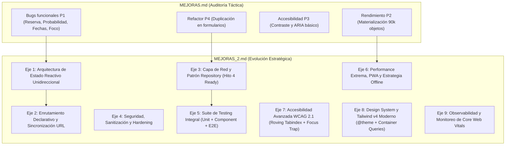
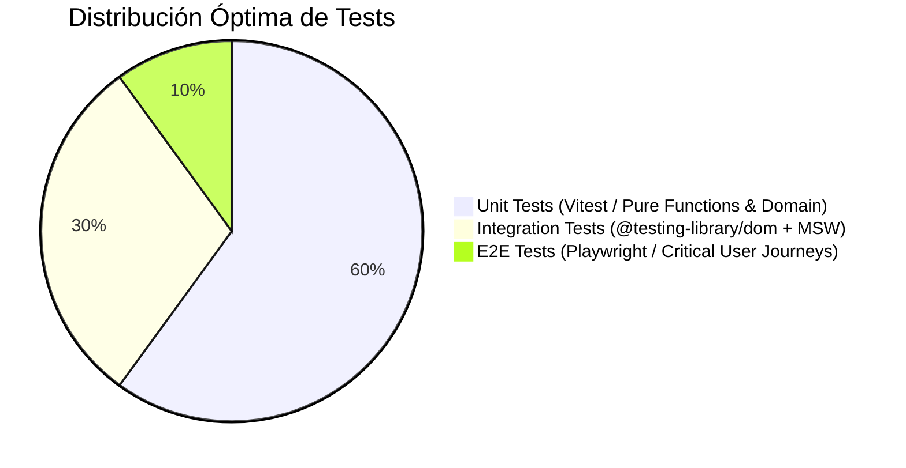

# Propuestas de Mejora Avanzadas (Fase 2) — ClickTuCasa Frontend

**Fecha de elaboración:** agosto de 2026  
**Complemento directo de:** [MEJORAS.md](./MEJORAS.md)  
**Alcance:** Arquitectura de software, reactividad, enrutamiento, seguridad, testing automatizado, alineación con Hitos 3 y 4 (Clean Architecture / Spring Boot), PWA/Offline y observabilidad.

---

## Resumen ejecutivo y relación con MEJORAS.md

Mientras que **`MEJORAS.md`** se enfocó con notable precisión en la auditoría forense del código actual (resolución de bugs funcionales P1, fugas de memoria por materialización de 90.000 objetos, corrección de contrastes WCAG y eliminación de duplicaciones), este documento **`MEJORAS_2.md`** proyecta la aplicación hacia un estándar **enterprise-ready y de alta mantenibilidad**.

Se abordan las áreas estructurales necesarias para transformar el prototipo en una **Single Page Application (SPA) reactiva, resiliente, segura y preparada para conectarse con la API REST de Spring Boot** que se desarrollará en el Hito 4.



---

## 🏛️ Eje 1 · Arquitectura de Estado Global Reactivo (State Store)

### 1.1 Diagnóstico del problema actual
El estado de la aplicación se encuentra fragmentado en múltiples capas sin una única fuente de verdad:
- `main.ts` almacena `catalog: readonly Raffle[]` y `filters: CatalogFilters`.
- `RaffleBoardView` almacena `ticketGridState: TicketGridState` y `currentRaffleId`.
- `RaffleService` mantiene un `Map<string, Raffle>` estático para mutaciones.
- `PurchaseForm` y `ReservationForm` mantienen variables locales de `selection`.

**Consecuencia directa:** Al reservar o comprar boletos en el detalle, se actualiza `RaffleService.mutatedRaffles`, pero el `catalog` de `main.ts` queda desactualizado en memoria. Si el usuario regresa al catálogo sin forzar un refresco de red, los contadores de la tarjeta no reflejan las compras recién hechas.

### 1.2 Solución propuesta: Store Reactivo Ligero con Patrón Observer / Signals
Implementar un almacén inmutable y tipado con suscripción a eventos de cambio:

```ts
// src/store/app.store.ts
export interface AppState {
  readonly catalog: readonly Raffle[];
  readonly activeRaffleId: string | null;
  readonly filters: CatalogFilters;
  readonly selectedTickets: ReadonlySet<number>;
  readonly userSession: UserSession | null;
  readonly isLoading: boolean;
  readonly error: string | null;
}

export type Listener<T> = (state: T) => void;

export class Store<T> {
  private state: T;
  private listeners = new Set<Listener<T>>();

  constructor(initialState: T) {
    this.state = Object.freeze(initialState);
  }

  getState(): T {
    return this.state;
  }

  setState(updater: (prev: T) => T): void {
    const nextState = Object.freeze(updater(this.state));
    if (nextState !== this.state) {
      this.state = nextState;
      this.listeners.forEach((listener) => listener(this.state));
    }
  }

  subscribe(listener: Listener<T>): () => void {
    this.listeners.add(listener);
    return () => this.listeners.delete(listener);
  }
}
```

**Beneficios:**
- Unidireccionalidad de datos (Data Down, Actions Up).
- Sincronización instantánea entre la grilla, los formularios y las tarjetas del catálogo.
- Fácil depuración con posibilidad de implementar Time-Travel Debugging o logging de acciones en modo DEV.

---

## 🧭 Eje 2 · Enrutamiento Declarativo y Sincronización con la URL

### 2.1 Diagnóstico
Actualmente la aplicación no cuenta con enrutador:
- La navegación entre catálogo y detalle se realiza mediante funciones imperativas en `main.ts` (`showRaffleList()`, `showRaffleDetail(id)`).
- **No existe Deep Linking:** Si un usuario quiere compartir una rifa específica (ej. por WhatsApp o correo), no existe una URL como `clicktucasa.cl/#/rifa/raffle-1`.
- **Pérdida de estado al refrescar:** Si el usuario presiona `F5` mientras está en el detalle o revisando un boleto ganador, la aplicación lo expulsa de vuelta al catálogo inicial.
- **Filtros no persistentes:** Los filtros de búsqueda, ciudad y ordenación se pierden al navegar y no son compartibles por URL.

### 2.2 Solución propuesta: Micro-Enrutador Basado en Hash o History API con Query Params

```ts
// src/router/router.ts
export interface RouteContext {
  pathname: string;
  params: Record<string, string>;
  queryParams: URLSearchParams;
}

export type RouteHandler = (context: RouteContext) => void | Promise<void>;

export class Router {
  private routes: Array<{ pattern: RegExp; keys: string[]; handler: RouteHandler }> = [];

  addRoute(pathPattern: string, handler: RouteHandler): this {
    const keys: string[] = [];
    const regexPattern = pathPattern.replace(/:([a-zA-Z0-9_]+)/g, (_, key) => {
      keys.push(key);
      return '([^/]+)';
    });
    this.routes.push({ pattern: new RegExp(`^${regexPattern}$`), keys, handler });
    return this;
  }

  navigate(url: string, replace = false): void {
    if (replace) {
      window.history.replaceState({}, '', url);
    } else {
      window.history.pushState({}, '', url);
    }
    this.resolve();
  }

  resolve(): void {
    const [path, search] = window.location.hash.slice(1).split('?');
    const pathname = path || '/';
    const queryParams = new URLSearchParams(search || '');

    for (const route of this.routes) {
      const match = pathname.match(route.pattern);
      if (match) {
        const params: Record<string, string> = {};
        route.keys.forEach((key, index) => {
          params[key] = decodeURIComponent(match[index + 1]);
        });
        void route.handler({ pathname, params, queryParams });
        return;
      }
    }
  }

  listen(): void {
    window.addEventListener('popstate', () => this.resolve());
    window.addEventListener('hashchange', () => this.resolve());
    this.resolve();
  }
}
```

### 2.3 Mapeo de Rutas de ClickTuCasa
| Ruta | Vista | Parámetros / Query Params |
|---|---|---|
| `/#/` | Catálogo de Rifas | `?search=zapallar&city=Zapallar&status=ACTIVE&sort=POPULAR` |
| `/#/rifa/:id` | Detalle de la Rifa | `:id` (ej. `raffle-1`), `?page=2&selected=42,43,44` |
| `/#/rifa/:id/acta` | Certificación Notarial / Acta | `:id` con visualización legal expandida |

---

## 🔌 Eje 3 · Capa de Red y Patrón Repository (Alineación con Hito 4 Spring Boot)

### 3.1 Diagnóstico
En la actualidad, `RaffleService` asume responsabilidades mixtas:
- Realiza llamadas `fetch()` directas a `./data/raffles.json`.
- Aplica mutaciones en memoria sobre un `Map` estático.
- Simula latencia de red (`delay`) y fallos aleatorios con `Math.random()`.
- Valida y transforma el payload JSON crudo.

### 3.2 Solución propuesta: Separación en Puertos y Adaptadores (Ports & Adapters)
Replicando la Clean Architecture del backend Java (Hito 3), el frontend debe desacoplar el contrato del repositorio de su implementación concreta:

```
src/
├── core/
│   ├── ports/
│   │   └── raffle.repository.ts        <-- Interfaz pura del puerto
│   └── usecases/
│       ├── getCatalog.usecase.ts
│       ├── reserveTickets.usecase.ts
│       └── purchaseTickets.usecase.ts
└── infrastructure/
    ├── http/
    │   ├── httpClient.ts               <-- Wrapper de fetch con interceptores y timeout
    │   └── apiConfig.ts
    └── repositories/
        ├── httpRaffle.repository.ts    <-- Para Hito 4 (Spring Boot REST)
        └── inMemoryRaffle.repository.ts<-- Para Hito 2 / Tests unitarios
```

#### Contrato del Puerto en TypeScript:
```ts
// src/core/ports/raffle.repository.ts
export interface RaffleRepository {
  findAll(signal?: AbortSignal): Promise<readonly Raffle[]>;
  findById(id: string, signal?: AbortSignal): Promise<Raffle>;
  reserve(request: ReserveTicketRequest): Promise<Raffle>;
  purchase(request: PurchaseTicketRequest): Promise<Raffle>;
  drawWinner(raffleId: string): Promise<DrawWinnerResult>;
}
```

#### Cliente HTTP con AbortController, Timeout y Retry Automático:
```ts
// src/infrastructure/http/httpClient.ts
export class HttpClient {
  constructor(private baseUrl: string, private defaultTimeoutMs = 10_000) {}

  async request<T>(endpoint: string, options: RequestInit = {}): Promise<T> {
    const controller = new AbortController();
    const timeoutId = setTimeout(() => controller.abort(), this.defaultTimeoutMs);

    try {
      const response = await fetch(`${this.baseUrl}${endpoint}`, {
        ...options,
        signal: options.signal ?? controller.signal,
        headers: {
          'Content-Type': 'application/json',
          Accept: 'application/json',
          ...options.headers,
        },
      });

      clearTimeout(timeoutId);

      if (!response.ok) {
        throw new HttpError(response.status, response.statusText, await response.text());
      }

      return (await response.json()) as T;
    } catch (error: unknown) {
      clearTimeout(timeoutId);
      if (error instanceof DOMException && error.name === 'AbortError') {
        throw new Error('La petición fue cancelada por exceder el tiempo de espera.');
      }
      throw error;
    }
  }
}
```

---

## 🔒 Eje 4 · Seguridad, Sanitización y Hardening

### 4.1 Riesgos Detectados en el Frontend
1. **Manipulación de Atributos mediante `innerHTML`:**
   En componentes como `RaffleFilters.ts:128`:
   ```ts
   value="${filters.search.replace(/"/g, '&quot;')}"
   ```
   Aunque se reemplazan comillas dobles, caracteres como `<` o `>` pueden abrir vectores si se alteran otras cadenas interpoladas.
2. **Identidad de Usuario no Verificada:**
   `userId` proviene directamente del campo de correo electrónico sin validación de sesión o token criptográfico.
3. **Ausencia de Política de Seguridad de Contenido (CSP):**
   No hay meta tags ni cabeceras que restrinjan orígenes de scripts o conexiones externas.

### 4.2 Medidas de Hardening Recomendadas
1. **Erradicación de `innerHTML` para datos dinámicos:**
   Crear los árboles DOM mediante `document.createElement`, `textContent` y la utilidad `createIconElement(iconName)` ya existente en `icon.utils.ts` pero que no se estaba utilizando.
2. **Definición de Content Security Policy (CSP) en `index.html`:**
   ```html
   <meta http-equiv="Content-Security-Policy" content="
     default-src 'self';
     img-src 'self' https://images.unsplash.com data:;
     font-src 'self' https://fonts.gstatic.com;
     style-src 'self' 'unsafe-inline' https://fonts.googleapis.com;
     connect-src 'self' http://localhost:8080;
   " />
   ```
3. **Desinfección Segura con Sanitizador Nativo o DOMPurify:**
   Para cualquier renderizado rico que requiera HTML estructurado, pasar previamente por un sanitizador de esquema estricto.

---

## 🧪 Eje 5 · Estrategia de Testing Integral (Unit, Integration & E2E)

### 5.1 Pirámide de Pruebas Propuesta



### 5.2 Configuración e Implementación

#### 1. Vitest + Testing Library:
```json
// package.json (scripts sugeridos)
"scripts": {
  "test": "vitest run",
  "test:watch": "vitest",
  "test:coverage": "vitest run --coverage",
  "test:e2e": "playwright test"
}
```

#### 2. Mock Service Worker (MSW) para Simulación Determinista de Red:
En lugar de `Math.random()` dentro del código de producción, usar MSW en desarrollo y tests para interceptar `/api/raffles` y simular respuestas 200, 404, 500 o fallos de conexión sin alterar el código de la aplicación.

#### 3. Casos de Prueba Críticos E2E (Playwright):
- **Flujo A (Compra Completa):** Navegar al catálogo → Filtrar por Zapallar → Entrar a la rifa → Elegir boletos con `+5` azar → Completar formulario con RUT válido → Comprar → Verificar toast de éxito y actualización de la grilla.
- **Flujo B (Concurrencia y Rechazo Parcial):** Simular que 2 de 5 boletos seleccionados ya fueron vendidos → Verificar que el sistema informa el resultado parcial detallando folios exitosos y fallidos con opción de reintento.

---

## ⚡ Eje 6 · Performance Extrema, PWA y Estrategia Offline

### 6.1 Optimización de Medios e Imágenes
- **Responsive Images con `srcset` y formatos modernos:**
  Actualmente se descargan imágenes de Unsplash de 1200px de ancho para renderizarlas en tarjetas de 380px.
  ```html
  <picture>
    <source srcset="casa-mediterranea-400w.avif 400w, casa-mediterranea-800w.avif 800w" type="image/avif">
    <source srcset="casa-mediterranea-400w.webp 400w, casa-mediterranea-800w.webp 800w" type="image/webp">
    
  </picture>
  ```
- **Aspect Ratio CSS intrínseco:** Establecer `aspect-ratio: 16 / 10` para garantizar cero *Cumulative Layout Shift* (CLS = 0) durante la carga diferida de imágenes.

### 6.2 Service Worker y Soporte Offline (PWA)
1. Implementar `@vite-pwa/plugin` para generar un Service Worker con estrategia `StaleWhileRevalidate` para los datos del catálogo y `CacheFirst` para fuentes y assets estáticos.
2. Permitir que el catálogo sea completamente navegable y consultable en modo avión o en zonas de baja cobertura celular (ej. visitas a terrenos rurales o playas en Zapallar/Pucón).

---

## ♿ Eje 7 · Accesibilidad Avanzada (WCAG 2.1 AA/AAA)

### 7.1 Navegación por Teclado en la Grilla de Boletos (Roving Tabindex)
- **Problema actual:** Con 200 celdas por página en `TicketGrid`, un usuario que navega con la tecla `Tab` debe presionar 200 veces antes de alcanzar los botones de paginación o el formulario.
- **Solución estándar WAI-ARIA:**
  - El contenedor de la grilla tiene `role="grid"`.
  - Solo la celda activa tiene `tabindex="0"`; todas las demás tienen `tabindex="-1"`.
  - Las flechas `ArrowUp`, `ArrowDown`, `ArrowLeft`, `ArrowRight` desplazan el foco por la matriz bidimensional.
  - La tecla `Space` o `Enter` alterna la selección del boleto.
  - `Home` y `End` van al primer y último boleto de la página visible.

```ts
// src/components/TicketGrid/gridKeyNav.ts
export function handleGridKeyNavigation(event: KeyboardEvent, gridElement: HTMLElement): void {
  const target = event.target as HTMLElement;
  if (!target.matches('[role="gridcell"]')) return;

  const cells = Array.from(gridElement.querySelectorAll<HTMLElement>('[role="gridcell"]'));
  const currentIndex = cells.indexOf(target);
  const columns = 10; // calculado dinámicamente según viewport

  let nextIndex = -1;

  switch (event.key) {
    case 'ArrowRight': nextIndex = currentIndex + 1; break;
    case 'ArrowLeft': nextIndex = currentIndex - 1; break;
    case 'ArrowDown': nextIndex = currentIndex + columns; break;
    case 'ArrowUp': nextIndex = currentIndex - columns; break;
    case 'Home': nextIndex = 0; break;
    case 'End': nextIndex = cells.length - 1; break;
  }

  if (nextIndex >= 0 && nextIndex < cells.length) {
    event.preventDefault();
    target.setAttribute('tabindex', '-1');
    cells[nextIndex].setAttribute('tabindex', '0');
    cells[nextIndex].focus();
  }
}
```

### 7.2 Diálogos Modales con Focus Trap
- Añadir confirmación modal accesible antes de ejecutar compras de alto valor:
  - Al abrirse, guarda el elemento que tenía el foco activo.
  - Atrapa la navegación con tabulación dentro del diálogo.
  - Cierra con `Escape` y devuelve el foco exactamente a donde estaba el usuario.
  - Establece `aria-modal="true"` y añade `inert` al resto del documento.

---

## 🎨 Eje 8 · Design System y Tailwind CSS v4 Moderno

### 8.1 Unificación de Tokens en `@theme`
En `style.css`, existen variables `--ctc-*` declaradas en `:root` que nunca se utilizan porque conviven con clases utilitarias de Tailwind. 

Con **Tailwind CSS v4**, se debe utilizar la directiva `@theme` para conectar los tokens de diseño directamente con el motor utilitario:

```css
/* src/style.css */
@import 'tailwindcss';

@theme {
  --color-brand-bg: #020617;
  --color-brand-surface: #0f172a;
  --color-brand-border: #1e293b;
  --color-brand-primary: #4f46e5;
  --color-brand-primary-hover: #4338ca;
  --color-brand-accent: #10b981;
  --color-brand-warning: #f59e0b;
  --color-brand-danger: #f43f5e;

  --font-sans: 'Plus Jakarta Sans', system-ui, -apple-system, sans-serif;
  --font-display: 'Outfit', 'Plus Jakarta Sans', system-ui, sans-serif;
}
```

### 8.2 Container Queries para Tarjetas de Rifas
Reemplazar media queries dependientes del viewport (`sm:`, `md:`, `lg:`) por **Container Queries (`@container`)** en `RaffleCard`. De esta forma, si la tarjeta se coloca en un sidebar angosto, en un modal o en una grilla de 3 columnas, su tipografía y distribución se adaptan al ancho real del contenedor y no de la pantalla completa.

---

## 📊 Eje 9 · Observabilidad, Telemetría y Core Web Vitals

### 9.1 Logger Estructurado con Niveles de Severidad
Actualmente el proyecto utiliza `console.error` directo. Se propone un servicio de logging estructurado que soporte envío a un colector externo (ej. Datadog, Sentry o Elastic) en producción:

```ts
// src/utils/logger.ts
export enum LogLevel { DEBUG = 0, INFO = 1, WARN = 2, ERROR = 3 }

export class Logger {
  constructor(private context: string, private minLevel: LogLevel = LogLevel.INFO) {}

  info(message: string, meta?: Record<string, unknown>): void {
    if (this.minLevel <= LogLevel.INFO) {
      console.info(`[${new Date().toISOString()}] [INFO] [${this.context}] ${message}`, meta ?? '');
    }
  }

  error(message: string, error?: unknown, meta?: Record<string, unknown>): void {
    if (this.minLevel <= LogLevel.ERROR) {
      console.error(`[${new Date().toISOString()}] [ERROR] [${this.context}] ${message}`, {
        error: error instanceof Error ? { name: error.name, message: error.message, stack: error.stack } : error,
        ...meta,
      });
    }
  }
}
```

### 9.2 Medición en Tiempo Real de Core Web Vitals
Implementar la librería estándar `web-vitals` para supervisar:
- **LCP (Largest Contentful Paint):** Carga del Hero Image de la rifa (< 2.5s).
- **INP (Interaction to Next Paint):** Respuesta al hacer clic en un boleto de la grilla (< 200ms).
- **CLS (Cumulative Layout Shift):** Estabilidad visual durante el renderizado (< 0.1).

---

## 🗺️ Eje 10 · Matriz de Implementación y Roadmap Evolutivo

| Iniciativa | Eje | Impacto | Esfuerzo | Fase Recomendada |
|---|---|---|---|---|
| **Store Reactivo (Observer Pattern)** | Eje 1 | 🔥 Crítico | Medio | Hito 2 (Refactor) |
| **Enrutador con Deep Linking y Hash** | Eje 2 | 🔥 Alto | Bajo | Hito 2 (Refactor) |
| **Roving Tabindex en Grilla de Boletos** | Eje 7 | ♿ Alto | Bajo | Hito 2 (Refactor) |
| **Suite de Tests Vitest (Dominio + Forms)** | Eje 5 | 🧪 Crítico | Medio | Hito 2 / 3 |
| **Separación en Puertos y HttpClient** | Eje 3 | 🏛️ Alto | Medio | Hito 3 |
| **MSW (Mock Service Worker)** | Eje 5 | 🧪 Medio | Bajo | Hito 3 |
| **Integración REST Spring Boot** | Eje 3 | 🚀 Máximo | Medio | Hito 4 |
| **Optimización de Imágenes + PWA** | Eje 6 | ⚡ Medio | Medio | Hito 4 |
| **Telemetría y Observabilidad** | Eje 9 | 📊 Medio | Bajo | Hito 4 |

---

## Conclusión

El documento `MEJORAS.md` sentó una base impecable para corregir los defectos específicos de la entrega actual. **`MEJORAS_2.md`** eleva el proyecto hacia una arquitectura desacoplada, observable, altamente accesible y preparada para la integración con servicios backend empresariales, manteniendo el compromiso de excelencia técnica que caracteriza a **ClickTuCasa**.
